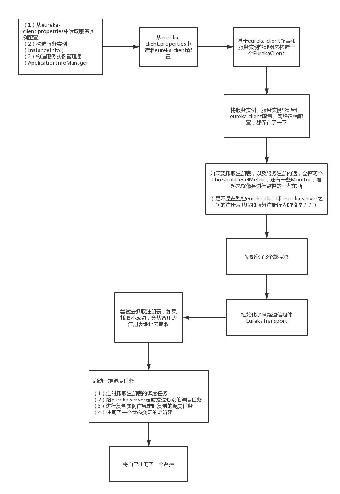

## DiscoveryClient

com.netflix.discovery.DiscoveryClient#DiscoveryClient(com.netflix.appinfo.ApplicationInfoManager, com.netflix.discovery.EurekaClientConfig, com.netflix.discovery.AbstractDiscoveryClientOptionalArgs, javax.inject.Provider<com.netflix.discovery.BackupRegistry>, com.netflix.discovery.shared.resolver.EndpointRandomizer)

 

（1）读取eureka-client.properties配置文件，形成一个服务实例的配置，基于接口对外提供服务实例的配置项的读取

（2）基于服务实例的配置，构造了一个服务实例（InstanceInfo）

（3）基于服务实例的配置和服务实例，构造了一个服务实例管理器（ApplicationInfoManager）

（4）读取eureka-client.properites配置文件，形成一个eureka client的配置，接口接口对外提供eureka client的配置项的读取

（5）基于eureka client配置，和服务实例管理器，来构造了一个EurekaClient（DiscoveryClient），保存了一些配置，处理服务的注册和注册表的抓取，启动了几个线程池，启动了网络通信组件，启动了一些调度任务，注册了监控项