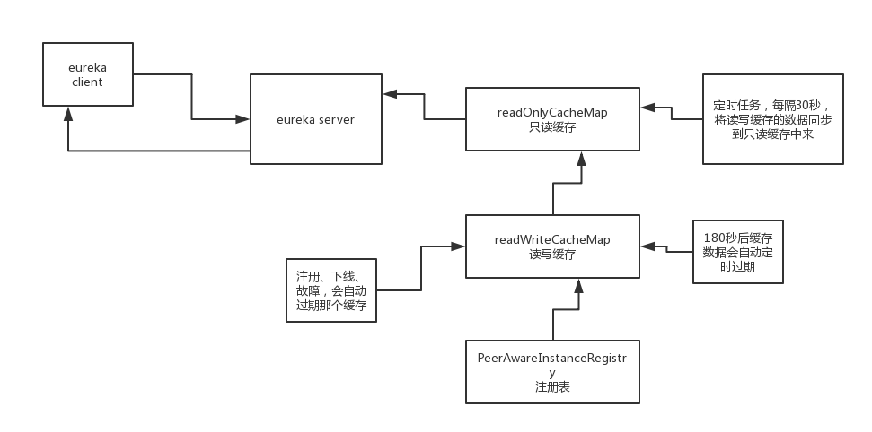

eureka client初始化的时候，就会自动发送个请求到eureka server拉一次清抓取全量的注册表，这一讲，我们来看看eureka server端如何处理抓取全量注册表的请求的，eureka client发送的请求是：http://localhost:8080/v2/apps/，get请求 

 

ApplicationsResource的getContainers()方法，获取全量注册表的方法

 

说一个源码阅读的小技巧：抓大放小，看源码的整体架构、核心流程、复杂机制

 

很多琐碎的小代码，你可能很难看懂，不是你的问题，是开源项目的源码贡献者写的代码其实也很乱，很凌乱，命名都不太靠谱，可能就导致代码的可读性不高，一般来说，你看，一些牛叉的开源项目，最最核心的几个人，其实都是那种特别牛的大牛，一开始就做这个开源项目的人，对这个开源项目很熟悉

 

如果是一个开源项目开始以后，临时半路杀进去的一个人，成为这个开源项目的核心贡献者，挺少的，很多开源项目的代码也是挺烂的，看都不好看

 

eureka server端，支持你来读取注册表的时候，搞了一套短小精干的多级缓存机制

 

也就是说，你eureka client发送请求过来读取全量注册表的时候，其实会从多级缓存里去读取注册表的数据，所以这里的cacheKey，就是全量注册表的缓存key

 

ResponseCache，就是eureka server端的缓存机制

 

多级缓存机制，用了两个map，来做了两级缓存，只读缓存map，读写缓存map，先从只读缓存里去读，如果没有的话，会从读写缓存里去读，如果还是没有呢？如果这个读写缓存，没有缓存的话，会从eureka server的注册表中去读取

 

从注册表中获取所有的Applications，ServerCodecs，json序列化的组件，将Applications对象序列化为了一个json字符串，将注册表中读取出来的Applications，放入读写缓存，接着放入只读缓存中去

 

最后呢，就是将从多级缓存机制中读取出来的全量的Applications作为响应来返回

 


获取注册信息源码

 com.netflix.eureka.resources.ApplicationsResource#getContainers

com.netflix.eureka.registry.ResponseCacheImpl#get(com.netflix.eureka.registry.Key, boolean)

com.netflix.eureka.registry.ResponseCacheImpl#getValue

```
@VisibleForTesting
Value getValue(final Key key, boolean useReadOnlyCache) {
    Value payload = null;
    try {
        if (useReadOnlyCache) {
            final Value currentPayload = readOnlyCacheMap.get(key);
            if (currentPayload != null) {
                payload = currentPayload;
            } else {
                payload = readWriteCacheMap.get(key);
                readOnlyCacheMap.put(key, payload);
            }
        } else {
            payload = readWriteCacheMap.get(key);
        }
    } catch (Throwable t) {
        logger.error("Cannot get value for key : {}", key, t);
    }
    return payload;
}
```


com.netflix.eureka.registry.ResponseCacheImpl#readWriteCacheMap

```
this.readWriteCacheMap =
        CacheBuilder.newBuilder().initialCapacity(serverConfig.getInitialCapacityOfResponseCache())
                .expireAfterWrite(serverConfig.getResponseCacheAutoExpirationInSeconds(), TimeUnit.SECONDS)
                .removalListener(new RemovalListener<Key, Value>() {
                    @Override
                    public void onRemoval(RemovalNotification<Key, Value> notification) {
                        Key removedKey = notification.getKey();
                        if (removedKey.hasRegions()) {
                            Key cloneWithNoRegions = removedKey.cloneWithoutRegions();
                            regionSpecificKeys.remove(cloneWithNoRegions, removedKey);
                        }
                    }
                })
                .build(new CacheLoader<Key, Value>() {
                    @Override
                    public Value load(Key key) throws Exception {
                        if (key.hasRegions()) {
                            Key cloneWithNoRegions = key.cloneWithoutRegions();
                            regionSpecificKeys.put(cloneWithNoRegions, key);
                        }
                        Value value = generatePayload(key);
                        return value;
                    }
                });
```

com.netflix.eureka.registry.ResponseCacheImpl#generatePayload


```
private Value generatePayload(Key key) {
    Stopwatch tracer = null;
    try {
        String payload;
        switch (key.getEntityType()) {
            case Application:
                boolean isRemoteRegionRequested = key.hasRegions();

                if (ALL_APPS.equals(key.getName())) {//如果要
                    if (isRemoteRegionRequested) {
                        tracer = serializeAllAppsWithRemoteRegionTimer.start();
                        payload = getPayLoad(key, registry.getApplicationsFromMultipleRegions(key.getRegions()));
                    } else {
                        tracer = serializeAllAppsTimer.start();
                        payload = getPayLoad(key, registry.getApplications());
                    }
                } else if (ALL_APPS_DELTA.equals(key.getName())) {
                    if (isRemoteRegionRequested) {
                        tracer = serializeDeltaAppsWithRemoteRegionTimer.start();
                        versionDeltaWithRegions.incrementAndGet();
                        versionDeltaWithRegionsLegacy.incrementAndGet();
                        payload = getPayLoad(key,
                                registry.getApplicationDeltasFromMultipleRegions(key.getRegions()));
                    } else {
                        tracer = serializeDeltaAppsTimer.start();
                        versionDelta.incrementAndGet();
                        versionDeltaLegacy.incrementAndGet();
                        payload = getPayLoad(key, registry.getApplicationDeltas());
                    }
                } else {
                    tracer = serializeOneApptimer.start();
                    payload = getPayLoad(key, registry.getApplication(key.getName()));
                }
                break;
            case VIP:
            case SVIP:
                tracer = serializeViptimer.start();
                payload = getPayLoad(key, getApplicationsForVip(key, registry));
                break;
            default:
                logger.error("Unidentified entity type: {} found in the cache key.", key.getEntityType());
                payload = "";
                break;
        }
        return new Value(payload);
    } finally {
        if (tracer != null) {
            tracer.stop();
        }
    }
}
```


注册新服务缓存源码

com.netflix.eureka.registry.AbstractInstanceRegistry#register

com.netflix.eureka.registry.AbstractInstanceRegistry#invalidateCache

com.netflix.eureka.registry.ResponseCacheImpl#invalidate(java.lang.String, java.lang.String, java.lang.String)


com.google.common.cache.Cache#invalidate      谷歌的缓存方法


（1）主动过期

 

readWriteCacheMap，读写缓存

 

有新的服务实例发生注册、下线、故障的时候，就会去刷新readWriteCacheMap

 

比如说现在有一个服务A，ServiceA，有一个新的服务实例，Instance010来注册了，注册完了之后，其实必须是得刷新这个缓存的，然后就会调用ResponseCache.invalidate()，将之前缓存好的ALL_APPS这个key对应的缓存，给他过期掉

 

将readWriteCacheMap中的ALL_APPS缓存key，对应的缓存给过期掉

 

（2）定时过期

 

readWriteCacheMap在构建的时候，指定了一个自动过期的时间，默认值就是180秒，所以你往readWriteCacheMap中放入一个数据过后，自动会等180秒过后，就将这个数据给他过期了

 com.netflix.eureka.EurekaServerConfig#getResponseCacheAutoExpirationInSeconds       180秒

（3）被动过期

 

readOnlyCacheMap怎么过期呢？

 

默认是每隔30秒，执行一个定时调度的线程任务，TimerTask，有一个逻辑，会每隔30秒，对readOnlyCacheMap和readWriteCacheMap中的数据进行一个比对，如果两块数据是不一致的，那么就将readWriteCacheMap中的数据放到readOnlyCacheMap中来。

 

比如说readWriteCacheMap中，ALL_APPS这个key对应的缓存没了，那么最多30秒过后，就会同步到readOnelyCacheMap中去


 java.util.Timer#schedule(java.util.TimerTask, java.util.Date, long)

com.netflix.eureka.registry.ResponseCacheImpl#getCacheUpdateTask

java.util.TimerTask#run


（4）很重要的问题

 

假设有服务实例注册、下线、故障，要调用这个服务的其他服务，可能会过30秒之后才能感知到，为什么呢？因为这里在获取服务注册表的时候，有一个多级缓存的机制，最多是30秒才会去更新缓存

 

 

 

 

 


