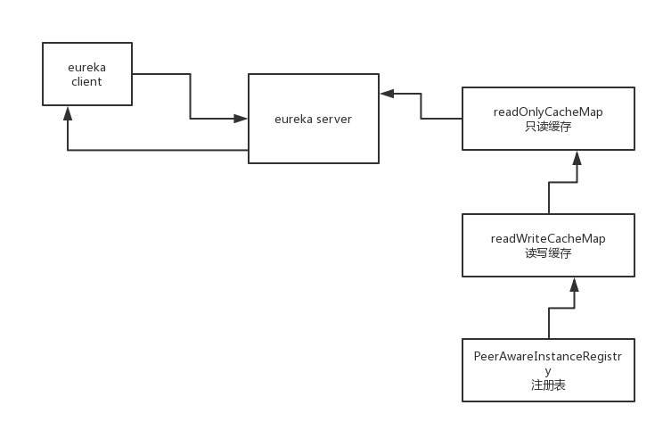

```
Key cacheKey = new Key(Key.EntityType.Application,
        ResponseCacheImpl.ALL_APPS,
        keyType, 
        CurrentRequestVersion.get(), 
        EurekaAccept.fromString(eurekaAccept), 
        regions
);
```

com.netflix.eureka.registry.ResponseCacheImpl#get(com.netflix.eureka.registry.Key, boolean)

com.netflix.eureka.registry.ResponseCacheImpl#getValue

```
@VisibleForTesting
Value getValue(final Key key, boolean useReadOnlyCache) {
    Value payload = null;
    try {
        if (useReadOnlyCache) {
            final Value currentPayload = readOnlyCacheMap.get(key);
            if (currentPayload != null) {
                payload = currentPayload;
            } else {
                payload = readWriteCacheMap.get(key);
                readOnlyCacheMap.put(key, payload);
            }
        } else {
            payload = readWriteCacheMap.get(key);
        }
    } catch (Throwable t) {
        logger.error("Cannot get value for key : {}", key, t);
    }
    return payload;
}
```

com.netflix.eureka.registry.ResponseCacheImpl#readWriteCacheMap

```
this.readWriteCacheMap =
        CacheBuilder.newBuilder().initialCapacity(serverConfig.getInitialCapacityOfResponseCache())
                .expireAfterWrite(serverConfig.getResponseCacheAutoExpirationInSeconds(), TimeUnit.SECONDS)
                .removalListener(new RemovalListener<Key, Value>() {
                    @Override
                    public void onRemoval(RemovalNotification<Key, Value> notification) {
                        Key removedKey = notification.getKey();
                        if (removedKey.hasRegions()) {
                            Key cloneWithNoRegions = removedKey.cloneWithoutRegions();
                            regionSpecificKeys.remove(cloneWithNoRegions, removedKey);
                        }
                    }
                })
                .build(new CacheLoader<Key, Value>() {
                    @Override
                    public Value load(Key key) throws Exception {
                        if (key.hasRegions()) {
                            Key cloneWithNoRegions = key.cloneWithoutRegions();
                            regionSpecificKeys.put(cloneWithNoRegions, key);
                        }
                        Value value = generatePayload(key);
                        return value;
                    }
                });
```

com.netflix.eureka.registry.ResponseCacheImpl#generatePayload


（1）主动过期

 

readWriteCacheMap，读写缓存

 

有新的服务实例发生注册、下线、故障的时候，就会去刷新readWriteCacheMap

 

比如说现在有一个服务A，ServiceA，有一个新的服务实例，Instance010来注册了，注册完了之后，其实必须是得刷新这个缓存的，然后就会调用ResponseCache.invalidate()，将之前缓存好的ALL_APPS这个key对应的缓存，给他过期掉

 

将readWriteCacheMap中的ALL_APPS缓存key，对应的缓存给过期掉

 

（2）定时过期

 

readWriteCacheMap在构建的时候，指定了一个自动过期的时间，默认值就是180秒，所以你往readWriteCacheMap中放入一个数据过后，自动会等180秒过后，就将这个数据给他过期了

 

（3）被动过期

 

readOnlyCacheMap怎么过期呢？

 

默认是每隔30秒，执行一个定时调度的线程任务，TimerTask，有一个逻辑，会每隔30秒，对readOnlyCacheMap和readWriteCacheMap中的数据进行一个比对，如果两块数据是不一致的，那么就将readWriteCacheMap中的数据放到readOnlyCacheMap中来。

 

比如说readWriteCacheMap中，ALL_APPS这个key对应的缓存没了，那么最多30秒过后，就会同步到readOnelyCacheMap中去

 

（4）很重要的问题

 

假设有服务实例注册、下线、故障，要调用这个服务的其他服务，可能会过30秒之后才能感知到，为什么呢？因为这里在获取服务注册表的时候，有一个多级缓存的机制，最多是30秒才会去更新缓存

 

 

 

 

 