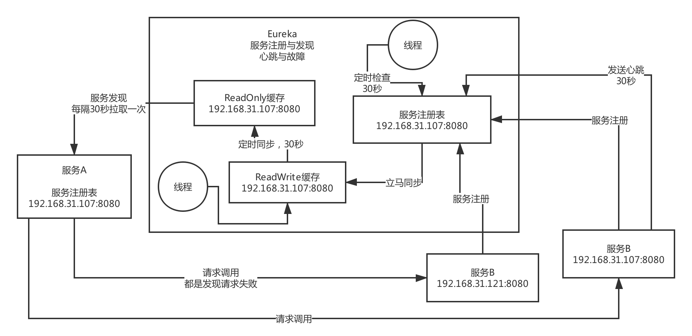

# Eureka源码开发

**eureka-client**，**eureka-core**       代码包就这2个 ，web页面就一个  **eureka-server**


## Eureka 原理图




90秒

## 常用配置

eureka.instance.leaseRenewallIntervalInSeconds

eureka.instance.leaseExpirationDurationInSeconds

eureka.client.registryFetchIntervalSeconds

eureka.server.enableSelfPreservation（enable-self-preservation）

eureka.server.renewalPercentThreshold

eureka.metadata.mykey=myvalue               在Eureka中传递外部元数据


fetchRegistry

registerWithEureka

如果是eureka server的话，在spring cloud的时候，会将这个fetchRegistry给手动设置为false，

因为如果单个eureka server启动的话，就不能设置，但是如果是eureka server集群的话，就还是要保持为true。registerWithEureka是否要设置为true。

 两个配置均为false， 那么Discovery的初始化将直接结束，表示该客户端既不进行服务注册也不进行服务发现


## Eureka 角色

Application    提供的服务接口

Applications   本地注册信息的缓存

```java
private final AtomicReference<Applications> localRegionApps = new AtomicReference<Applications>();
```

InstanceInfo    集群实例，服务可能会部署在多台机器上，每台机器上部署的就是一个服务实例。

（1）主机名、ip地址、端口号、url地址

（2）lease（租约）的信息：保持心跳的间隔时间，最近心跳的时间，服务注册的时间，服务启动的时间

eureka server

eureka client

ApplicationInfoManager   包含了服务实例的信息、配置，作为服务实例管理的一个组件

InstanceRegisterManager  实例注册管理器，专门来管理实例注册

appName，APPLICATION0，服务名称，ServiceA，或者是别的什么名称

instanceId，i-0000001，服务实例id，

AbstractInstanceRegistry， 和子类PeerAwareInstanceRegistryImpl 用来处理注册业务

ResponseCache   缓存


注册表

```
{
	“ServiceA”: {
		“001”: Lease<InstanceInfo>,
		“002”: Lease<InstanceInfo>,
		“003”: Lease<InstanceInfo>
	},
	“ServiceB”: {
		“001”: Lease<InstanceInfo>
	}
}

```


## Eureka 启动


## Eureka客户端注册


在两种情况下客户端会主动向服务端发送自己的注册信息

1.当客户端的instance信息发生改变时，Eureka-Client和Server端信息不一致时

2.当客户端刚刚启动的时候。


InstanceInfoReplicator是一个负责服务注册的线程任务， 有两个地方可以执行这个任务

1.定时线程，每40秒执行一次。

2.当instance的状态发生变更（除去DOWN这个状态）的时候，会有statusChangeListener 这个监听器监听到


## Eureka服务端接受注册


在这个eureka core的resources包下面，有一堆的resources，这些resource相当于是spring web mvc的controller，用来接收这个http请求的。

ApplicationResource的addInstance()方法，是接收post请求的服务实例的注册。


本地注册表

清理缓存

复制到同等服务节点上去


```java
@Override
public void register(final InstanceInfo info, final boolean isReplication) {
    // 租约的过期时间，默认90秒，也就是说当服务端超过90秒没有收到客户端的心跳，则主动剔除该节点。
    int leaseDuration = Lease.DEFAULT_DURATION_IN_SECS;
    if (info.getLeaseInfo() != null && info.getLeaseInfo().getDurationInSecs() > 0) {
        // 如果客户端自定义了，那么以客户端为准
        leaseDuration = info.getLeaseInfo().getDurationInSecs();
    }
    // 节点注册
    super.register(info, leaseDuration, isReplication);
    // 复制到同等服务节点上去
    replicateToPeers(Action.Register, info.getAppName(), info.getId(), info, null, isReplication);
}
```


```java
public void register(InstanceInfo registrant, int leaseDuration, boolean isReplication) {
    try {
        // 上只读锁
        read.lock();
        // 从本地MAP里面获取当前实例的信息。
        Map<String, Lease<InstanceInfo>> gMap = registry.get(registrant.getAppName());
        // 增加注册次数到监控信息里面去。
        REGISTER.increment(isReplication);
        if (gMap == null) {
            // 如果第一次进来，那么gMap为空，则创建一个ConcurrentHashMap放入到registry里面去
            final ConcurrentHashMap<String, Lease<InstanceInfo>> gNewMap = new ConcurrentHashMap<String, Lease<InstanceInfo>>();
            // putIfAbsent方法主要是在向ConcurrentHashMap中添加键—值对的时候，它会先判断该键值对是否已经存在。
            // 如果不存在（新的entry），那么会向map中添加该键值对，并返回null。
            // 如果已经存在，那么不会覆盖已有的值，直接返回已经存在的值。
            gMap = registry.putIfAbsent(registrant.getAppName(), gNewMap);
            if (gMap == null) {
                // 表明map中确实不存在，则设置gMap为最新创建的那个
                gMap = gNewMap;
            }
        }
        // 从MAP中查询已经存在的Lease信息 （比如第二次来）
        Lease<InstanceInfo> existingLease = gMap.get(registrant.getId());
        // 当Lease的对象不为空时。
        if (existingLease != null && (existingLease.getHolder() != null)) {
            // 当instance已经存在是，和客户端的instance的信息做比较，时间最新的那个，为有效instance信息
            Long existingLastDirtyTimestamp = existingLease.getHolder().getLastDirtyTimestamp(); // server
            Long registrationLastDirtyTimestamp = registrant.getLastDirtyTimestamp();   // client
            logger.debug("Existing lease found (existing={}, provided={}", existingLastDirtyTimestamp, registrationLastDirtyTimestamp);
            if (existingLastDirtyTimestamp > registrationLastDirtyTimestamp) {
                logger.warn("There is an existing lease and the existing lease's dirty timestamp {} is greater" +
                        " than the one that is being registered {}", existingLastDirtyTimestamp, registrationLastDirtyTimestamp);
                logger.warn("Using the existing instanceInfo instead of the new instanceInfo as the registrant");
                registrant = existingLease.getHolder();
            }
        } else {
            // 这里只有当existinglease不存在时，才会进来。 像那种恢复心跳，信息过期的，都不会进入这里。
            //  Eureka-Server的自我保护机制做的操作，为每分钟最大续约数+2 ，同时重新计算每分钟最小续约数
            synchronized (lock) {
                if (this.expectedNumberOfRenewsPerMin > 0) {
                    // Since the client wants to cancel it, reduce the threshold
                    // (1
                    // for 30 seconds, 2 for a minute)
                    this.expectedNumberOfRenewsPerMin = this.expectedNumberOfRenewsPerMin + 2;
                    this.numberOfRenewsPerMinThreshold =
                            (int) (this.expectedNumberOfRenewsPerMin * serverConfig.getRenewalPercentThreshold());
                }
            }
            logger.debug("No previous lease information found; it is new registration");
        }
        // 构建一个最新的Lease信息
        Lease<InstanceInfo> lease = new Lease<InstanceInfo>(registrant, leaseDuration);
        if (existingLease != null) {
            // 当原来存在Lease的信息时，设置他的serviceUpTimestamp, 保证服务开启的时间一直是第一次的那个
            lease.setServiceUpTimestamp(existingLease.getServiceUpTimestamp());
        }
        // 放入本地Map中
        gMap.put(registrant.getId(), lease);
        // 添加到最近的注册队列里面去，以时间戳作为Key， 名称作为value，主要是为了运维界面的统计数据。
        synchronized (recentRegisteredQueue) {
            recentRegisteredQueue.add(new Pair<Long, String>(
                    System.currentTimeMillis(),
                    registrant.getAppName() + "(" + registrant.getId() + ")"));
        }
        // This is where the initial state transfer of overridden status happens
        // 分析instanceStatus
        if (!InstanceStatus.UNKNOWN.equals(registrant.getOverriddenStatus())) {
            logger.debug("Found overridden status {} for instance {}. Checking to see if needs to be add to the "
                            + "overrides", registrant.getOverriddenStatus(), registrant.getId());
            if (!overriddenInstanceStatusMap.containsKey(registrant.getId())) {
                logger.info("Not found overridden id {} and hence adding it", registrant.getId());
                overriddenInstanceStatusMap.put(registrant.getId(), registrant.getOverriddenStatus());
            }
        }
        InstanceStatus overriddenStatusFromMap = overriddenInstanceStatusMap.get(registrant.getId());
        if (overriddenStatusFromMap != null) {
            logger.info("Storing overridden status {} from map", overriddenStatusFromMap);
            registrant.setOverriddenStatus(overriddenStatusFromMap);
        }
    
        // Set the status based on the overridden status rules
        InstanceStatus overriddenInstanceStatus = getOverriddenInstanceStatus(registrant, existingLease, isReplication);
        registrant.setStatusWithoutDirty(overriddenInstanceStatus);
    
        // If the lease is registered with UP status, set lease service up timestamp
        // 得到instanceStatus，判断是否是UP状态，
        if (InstanceStatus.UP.equals(registrant.getStatus())) {
            lease.serviceUp();
        }
        // 设置注册类型为添加
        registrant.setActionType(ActionType.ADDED);
        // 租约变更记录队列，记录了实例的每次变化， 用于注册信息的增量获取、
        recentlyChangedQueue.add(new RecentlyChangedItem(lease));
        registrant.setLastUpdatedTimestamp();
        // 清理缓存 ，传入的参数为key
        invalidateCache(registrant.getAppName(), registrant.getVIPAddress(), registrant.getSecureVipAddress());
        logger.info("Registered instance {}/{} with status {} (replication={})",
                registrant.getAppName(), registrant.getId(), registrant.getStatus(), isReplication);
    } finally {
        read.unlock();
    }
}
```


## 获取服务端注册信息

两种获取地方，启动和定时任务获取


启动获取

在客户端应用启动时，初始化DiscoverClient的时候，会主动去全量获取一次注册信息

DiscoveryClient  的  initScheduledTasks（）


定时器获取

registryFetchIntervalSeconds : 默认值为30秒 ，每30秒刷新一次，全量或者增量

DiscoveryClient  的 CacheRefreshThread（）


1.发起http请求，将服务端的客户端变化的信息拉取过来，如： register， cancle,  modify 有过这些操作的数据

2.上锁，防止某次调度网络请求时间过长，导致同一时间有多线程拉取到增量信息并发修改

3.将请求过来的增量数据和本地的数据做合并

4.计算hashCode

5.如果hashCode不一致，或者clientConfig.shouldLogDeltaDiff() = true 的话，则又会去服务端发起一次全量获取

6.数据合并

7.发布缓存刷新的事件

8.更新本地应用的状态


## 服务端返回注册信息

com.netflix.eureka.resources.ApplicationsResource

http://localhost:8080/v2/apps


### 全量获取

@GET

public Response getContainers

把服务端本地的CurrentHashMap里面存储的客户端信息，封装成Application实体，然后返回


### 增量获取

@Path("delta")

@GET

public Response getContainerDifferential

因为客户端本地已经有了缓存的Applications，所以再次向Eureka服务端抓取注册表的时候，走的是增量抓取的策略


Eureka服务端会在客户端发生变化时 如： 注册，下线，过期等操作的实例数据存入recentlyChangedQueue，

租约变化队列里面的数据默认保存3分钟，会有一个定时器每30秒清理一次获取到了这些变化的客户端信息，返回Eureka Clien 之后，通过集合合并，就可以得到最新的缓存数据了。

Eureka Clien对合并以后的注册表，会计算一个hash值，跟eureka server端的全量注册表的hash值进行一个比对；如果说不一样的话，说明本地注册表跟server端不一样了，此时就会重新从eureka server拉取全量的注册表到本地来更新到缓存里去


## Eureka缓存机制


### 缓存的更新

readOnlyCacheMap  只会30秒定时更新


readWriteCacheMap  180秒定时，或者服务下线， 过期，注册，状态变更的时候会清除


readWriteCacheMap ： 此处存放的是google的gauva缓存， 当服务下线，过期，注册，状态变更，都会来清除这个缓存里面的数据。 然后通过CacheLoader进行缓存加载，在进行readWriteCacheMap.get(key)的时候，首先看这个缓存里面有没有该数据，如果没有则通过CacheLoader的load方法去加载，加载成功之后将数据放入缓存，同时返回数据

readOnlyCacheMap ： 这是一个JVM的CurrentHashMap只读缓存，这个主要是为了供客户端获取注册信息时使用，其缓存更新，依赖于定时器的更新，通过和readWriteCacheMap 的值做对比，如果数据不一致，则以readWriteCacheMap 的数据为准。


### 缓存的读取


useReadOnlyCache ： shouldUseReadOnlyResponseCache ，可以配置是否使用只读缓存，默认是true

readWriteCacheMap.get(key) : 这个使用的是gauva 的缓存机制，如果当前的缓存里面这个key没有，那么

会直接调用CacheLoader.load()方法，从最上面的代码可以看到， load方法，主要是执行了generatePayload()


payload = getPayLoad(key, registry.getApplicationDeltas());

payload = getPayLoad(key, registry.getApplications());


## Eureka 心跳


### 心跳发送

DiscoverClient这个类初始化的时候，会初始化定期任务HeartbeatThread，每30秒执行一次，用来发送心跳

启动一个线程，然后线程执行renew()方法， 最终发送心跳给Eureka-Server

接口地址： apps/ + appName + /' + id ，


### 心跳接受

服务端  InstanceResource   的  renewLease方法 接受续约


如果接口返回值为404，就是说不存在，从来没有注册过，那么重新走注册流程


在调用续约的方法之后，Eureka Server 会对请求过来的lastDirtyTimestamp和本地的做对比，如果

请求lastDirtyTimestamp>本地的时间，则认为当前实例是无效的，返回404错误，客户端重新发起注册。

如果是集群同步请求，本地的时间，大于其他Eureka Server传过来的时间，则返回 “冲突” 这个状态回去，

以本地的时间大的为准，注意是集群同步请求，如果是客户端传过的，是不会有这个规则的。


PeerAwareInstanceRegistryImpl    集群续约

AbstractInstanceRegistry		客户端续约


## Eureka 主动下线


取消定时任务（心跳，缓存刷新等）

设置实例的状态为DOWN

发送HTTP请求执行下线


PeerAwareInstanceRegistryImpl 的父类AbstractInstanceRegistry中是取消下线的主要逻辑。


InstanceResource中，调用注册表的cancelLease()方法，调用父类的canel()方法，interlCancel()方法

com.netflix.eureka.registry.AbstractInstanceRegistry#internalCancel

将服务实例从eureka server的map结构的注册表中移除掉

最最核心的是调用了Lease的cancel()方法，里面保存了一个evictionTimestamp，就是服务实例被清理掉，服务实例下线的时间戳

将服务实例放入最近变化的队列中去，让所有的eureka client下一次拉取增量注册表的时候，可以拉取到这个服务实例下线的这么一个变化

服务实例变更过了，必须将之前的缓存都清理掉，从readWriteCacheMap中清理掉

定时的任务，每隔30秒，将readWriteCacheMap和readOnlyCacheMap进行一个同步

下次所有的eureka client来拉取增量注册表的时候，都会发现readOnlyCacheMap里没有，会找readWriteCacheMap也会发现没有，然后就会从注册表里抓取增量注册表，此时就会将上面那个recentCHangedQuuee中的记录返回


## 自动故障感知机制,自动摘除

### EvictionTask 执行逻辑

1. 算出延迟补偿时间.定时器自身所在的JVM发送GC或者linux服务器时间延迟导致时间变长.避免EvictionTask两次调度的时间超过了默认设置的60s.补偿时间的机制.
2. 遍历注册表中所有的服务实例，然后调用Lease的isExpired()方法，来判断当前这个服务实例的租约是否过期了，是否失效了，服务实例故障了，如果是故障的服务实例，加入一个列表.
3. 不会一次性将所有故障的服务实例都摘除，每次最多讲注册表中15%的服务实例给摘除掉，所以一次没摘除所有的故障实例，下次EvictionTask再次执行的时候，会再次摘除，分批摘取机制
4. 在摘除的时候，是从故障实例中随机挑选本次可以摘除的数量的服务实例，来摘除，随机摘取机制
5. 摘除服务实例的时候，其实就是调用下线的方法，internelCancel()方法，注册表、recentChangeQueue、invalidate缓存


### 过期时间计算bug

additionalLeaseMs 延迟补偿时间计算方法:  

additionalLeaseMs  =  过期任务定时器调度执行时间  -  currentTimeMillis  


lastUpdateTimestamp 心跳续约时间的计算方法:

lastUpdateTimestamp = currentTimeMillis + 90s

每一次续约过来时,会把当前时间加90秒,(90秒内没收到一个client的服务续约) ,由此得出lastUpdateTimestamp.


evictionTimestamp  判断续约Lease的isExpired()的时间计算方法

evictionTimestamp   =  lastUpdateTimestamp+90秒+延迟补偿时间.

当前时间是否大于上一次心跳时间也就是


这里有个错误，因为续约的时候，更新这个时间的时候，加上了duration ， 但是在最终做判断的时候lastUpdateTimestamp + duration + additionalLeaseMs ， 这个地方还加了一遍，也就导致了，当前时间必须要大于实际最后更新时间180秒，才会认为他过期.


### 分批过期机制

每次最多过期15%的机器，超过15%则不会自动过期


当有一批过期的机器需要摘除,并不是每次把15%的机器分几个批次都过期,有可能因为自动保护,导致有些实例摘除的时间并不确定.


假如检测到过期的实例数量为4台 ， 总数量为10

第一个60秒到来，执行任务

int registrySize = 10 ;
int registrySizeThreshold = (int) (registrySize * 0.85) ;// 值为8
// 可以过期的数量
int evictionLimit = registrySize - registrySizeThreshold; //值为2


第二个60秒到来，执行任务 

numberOfRenewsPerMinThreshold还是原来的值，也就是 20*0.85 = 17 , 

但是由于存活的机器数量只有6台，则每秒最大续约数为12 ， 12>17 = false , 所以会开启自动保护机制

如果在一分钟之类，另外两台机器恢复了心跳，16>17 ， 依旧会开启自动保护机制

只能等待15分钟之后，定时任务重新计算这两个参数的值。

开启自我保护机制之后，则不会继续往下执行故障自动摘除的逻辑.无法摘除.


总结：客户端具体的过期时间需要更加具体情况判断，但是必须大于180秒(2个90秒,其中一个90秒是bug)， 再加上定时任务的时间间隔，240秒，


## Eureka自动保护机制


Eureka在CAP理论当中是属于AP ， 也就说当产生网络分区时，Eureka保证系统的可用性，但不保证系统里面数据的一致性， 举个例子。当发生网络分区的时候，Eureka-Server和client端的通信被终止，server端收不到大部分的client的续约，这个时候，如果直接将没有收到心跳的client端自动剔除，那么会将可用的client端剔除，这不符合AP理论，所以Eureka宁可保留也许已经宕机了的client端 ， 也不愿意将可以用的client端一起剔除。 从这一点上，也就保证了Eureka程序的健壮性，符合AP理论


### 自我保护核心参数

```java
this.expectedNumberOfRenewsPerMin = count * 2;
this.numberOfRenewsPerMinThreshold =(int) (this.expectedNumberOfRenewsPerMin * serverConfig.getRenewalPercentThreshold());.expectedNumberOfRenewsPerMin = count * 2;
this.numberOfRenewsPerMinThreshold =(int) (this.expectedNumberOfRenewsPerMin * serverConfig.getRenewalPercentThreshold());
```

expectedNumberOfRenewsPerMin ：每分钟最大的续约数量，由于客户端是每30秒续约一次，一分钟就是续约2次， count代表的是客户端数量所以这个变量的计算公式 ： 客户端数量*2 numberOfRenewsPerMinThreshold ： 每分钟最小续约数量， 使用expectedNumberOfRenewsPerMin * serverConfig.getRenewalPercentThreshold()。serverConfig.getRenewalPercentThreshold()的默认值为0.85 ， 也就是说每分钟的续约数量要大于85% 。

 如果每分钟的续约数量小于numberOfRenewsPerMinThreshold ， 就会开启自动保护机制。在此期间，不会再主动剔除任何一个客户端


Eureka-Server初始化，cancle主动下线， 客户端注册 ,定时器， 这四个场景会更新这两个变量


Eureka-Server初始化   每分钟期望心跳次数

```md-end-block
    // 此处初始化值，客户端数量*2 
    this.expectedNumberOfRenewsPerMin = count * 2;
    // serverConfig.getRenewalPercentThreshold() 默认为0.85
    this.numberOfRenewsPerMinThreshold =
            (int) (this.expectedNumberOfRenewsPerMin * serverConfig.getRenewalPercentThreshold());
```


客户端注册  每分钟期望心跳次数 + 2

```md-end-block
this.expectedNumberOfRenewsPerMin = this.expectedNumberOfRenewsPerMin + 2;
```

cancle主动下线   每分钟期望心跳次数 - 2

```md-end-block
  this.expectedNumberOfRenewsPerMin = this.expectedNumberOfRenewsPerMin - 2;
```

故障 

故障的时候，摘除一个服务实例，没有更新期望心跳次数的代码。


### 自我保护机制开启时机

定期清理任务的线程EvictionTask 的 evict()方法,每60秒触发一次. 并判断如果小于最小续约数会触发自我保护机制


### 自我保护机制解除时机

1. 当服务的网络分区解除之后，客户端能够和服务进行交互时，在续约的时候，更新每分钟的续约数，当每分钟的续约数大于85%时，则自动解除。

2. 重新启动也会解除.

3. 15分钟后重新计算.PeerAwareInstanceRegistryImpl   集群注册表，默认是15分钟，会跑一次定时任务，算一下服务实例的数量，如果从别的eureka server拉取到的服务实例的数量，大于当前的服务实例的数量，会重新计算一下，主要是跟其他的eureka server做一下同步


## 集群同步


### 集群同步初始化启动

在Eureka启动时,会开始集群同步,从本地内存里面读取 注册信息，自动注册到本身的服务上.eureka server自己本身本来就是个eureka client，集群节点在启动的时候，会初始化Eureka Client端的配置 ，会从其他Eureka Server拉取注册信息到本地,同时在初始化Eureka Server的时候，会从本地内存里面读取 注册信息，自动注册到本身的服务上.

注意: SyncUp()这个方法并不会去其他Eureka Server节点复制信息，而是从本地内存里面获取注册信息

com.netflix.eureka.registry.PeerAwareInstanceRegistry#syncUp

eurekaClient.getApplications(); 从本地拉取


```
eureka.client.register-with-eureka = true    ## 是否作为一个Eureka Client 注册到Eureka Server上去
eureka.client.fetch-registry = true              ## 是否需要从Eureka Server上拉取注册信息到本地。eureka.client.register-with-eureka = true    ## 是否作为一个Eureka Client 注册到Eureka Server上去
eureka.client.fetch-registry = true              ## 是否需要从Eureka Server上拉取注册信息到本地。
```

集群同步必须开启

Eureka Server在启动的时候可以同步其他集群节点的注册信息，那么必须开启客户端配置


### 集群同步业务类型

集群同步的业务内容, 心跳续约,注册,下线,添加删除覆盖状态.

com.netflix.eureka.registry.PeerAwareInstanceRegistryImpl.Action

```
Heartbeat ： 心跳续约

Register ： 注册

Cancel ： 下线

StatusUpdate ： 添加覆盖状态

DeleteStatusOverride ： 删除覆盖状态
```


### 集群同步发起


通过 isReplication 来判断是否集群操作, isReplication = true 表示是其他Eureka Server发过来的同步请求

如果是isReplication=true,则不需要继续向其他节点同步


1.判断集群节点是否为空，为空则返回

2.isReplication 代表是否是一个复制请求， isReplication = true 表示是其他Eureka Server发过来的同步请求

这个时候是不需要继续往下同步的。否则会陷入同步死循环

3.循环集群节点，过滤掉自身的节点

4.发起同步请求 ，调用replicateInstanceActionsToPeers


有两个地方会发生同步

PeerEurekaNode初始化,

每15分钟一次定时任务


## 集群同步处理

同步的执行是使用批处理的模式

批量处理的任务执行器是com.netflix.eureka.cluster.ReplicationTaskProcessor

请求批量处理的接口地址 ： peerreplication/batch/

handleBatchResponse(tasks, response.getEntity().getResponseList()) ， 循环调用处理结果，

成功则调用handleSuccess. , 失败则调用handleFailure ， 比如hearbeat的时候，调用返回码为

404的时候，会重新发起注册。

REPLICATION = “true” ,此次请求为true，表示是一个服务端的复制请求。

集群同步走的和客户端注册的后续流程是一样的，只不过isReplication=true , 表明这是一个集群同步的请求


如果是某台eureka client来找eureka server进行注册，isReplication是false，此时会给其他所有eureka server都同步这个注册请求，调用其他所有的eureka server的注册接口，去执行这个服务实例的注册的请求

ReplicationHttpClient，此时同步注册请求给其他eureka server的时候，一定会将isReplication设置为true，这个东西可以确保说什么呢，其他eureka server接到这个同步的请求，仅仅在自己本地执行，不会再次向其他的eureka server去进行注册

 

数据同步的异步批处理机制：闪光点，三个队列，第一个队列，就是纯写入；第二个队列，是用来根据时间和大小，来拆分队列；第三个队列，用来放批处理任务 ==》 异步批处理机制


.png)


## Spring cloud 整合

### 服务器整合

EurekaServerAutoConfiguration、EurekaServerInitializerConfiguration、EurekaServerBootstrap，三个类，在spring boot启动之后，完成了原来BootStrap初始化和启动eureka server的几乎一模一样的所有的代码逻辑。


@EnableEurekaServer

org.springframework.cloud.netflix.eureka.server.EnableEurekaServer

org.springframework.cloud.netflix.eureka.server.EurekaServerAutoConfiguration


EurekaServerAutoConfiguration，依托spring boot的auto configuration机制，直接我们就是使用一个注解@EnableEurekaServer，触发了EurekaServerAutoConfiguration的执行，直接一站式将我们需要的eureka server给初始化和启动。


Spring cloud + spring boot的环境中，需要的EurekaServerConfig、EurekaClientConfig、EurekaInstanceConfig，都是从application.yml中去读取的，封装到EurekaServerConfigBean


### 客户端整合

EnableEurekaClient触发EurekaClientAutoConfiguration发现


EurekaClientConfigBean从application.yml中，配置项读取出来，通过这个bean来对外提供所有的eureka client相关的配置项的读取。实现的就是EurekaClientConfig接口。EurekaInstanceConfigBean，同理，加载application.yml中的服务实例相关的配置项。

 

EurekaClientAutoConfiguration，完成了DiscoveryClient的构造和初始化，eureka client初始化和启动的流程，全部在DiscoveryClient中的。EurekaDiscoveryClient，自己对eureka原生的DiscoveryClient进行了一层封装和包装，实现了eureka的DiscoveryClient接口，依赖了一个原生的EurekaClient。提供了一些额外的方法的实现。


 org.springframework.cloud.netflix.eureka.serviceregistry.EurekaAutoServiceRegistration

EurekaAutoServiceRegistration将原来的InstanceInfoReplicator组件里面的服务注册的逻辑，进行了一定的封装，服务注册相关的重要的逻辑，不能封装在那么不清不楚的InstanceInfoReplicator中。在这里提供了服务注册方法。

 

在原生的eureka client的注册里，其实eureka client启动之后，要延迟几十秒，才会去完成注册。EurekaAutoServiceRegistration，里面包含了一个start()方法，在这个spring boot启动之后，直接就会执行start()方法，直接就去执行一个注册。

 

EurekaRegistration包含了一些组件，EurekaClient、ApplicationInfoManager之类的组件。

 

实际上，在spring boot一启动的时候，就会去执行EurekaServiceRegistry.register()方法,这个方法会发现什么也没干,注册时通过更改eureka服务状态, 状态发生改变后触发监听器来注册服务.

@EnableEurekaClient，触发了一个EurekaClientAutoConfiguration类的执行，完成从application.yml中读取配置，完成DiscoveryClient的初始化和启动，通过自己额外加的一些代码，一启动，直接触发一次register()服务注册，向eureka server完成一次注册。


## Eureka覆盖状态


## LastDirtyTimestamp 实例的最后修改时间